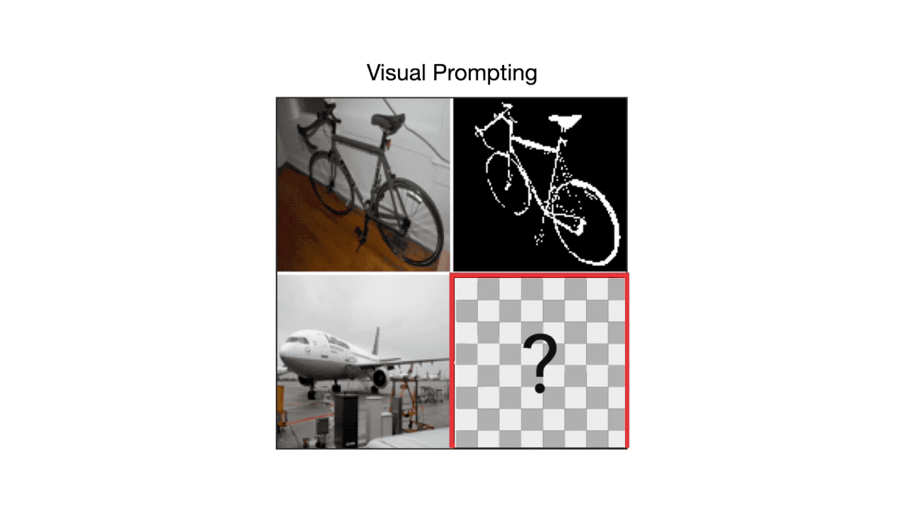
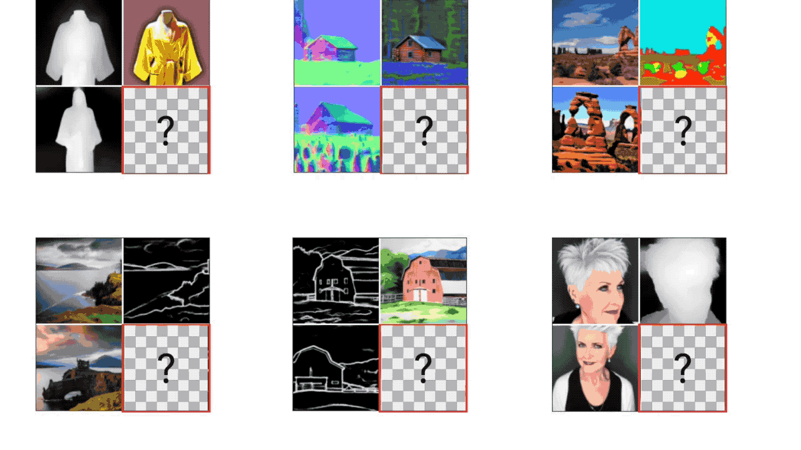

# IMProv: Inpainting-based Multimodal Prompting for Computer Vision Tasks

This repository is the official implementation of IMProv introduced in the paper:

[**IMProv: Inpainting-based Multimodal Prompting for Computer Vision Tasks**](https://arxiv.org/abs/2312.01771)

[*Jiarui Xu*](https://jerryxu.net),
[*Yossi Gandelsman*](https://yossigandelsman.github.io/),
[*Amir Bar*](https://www.amirbar.net/),
[*Jianwei Yang*](https://jwyang.github.io/),
[*Jianfeng Gao*](https://www.microsoft.com/en-us/research/people/jfgao/),
[*Trevor Darrell*](http://people.eecs.berkeley.edu/~trevor/),
[*Xiaolong Wang*](https://xiaolonw.github.io/)



## Visual Results
 
More in project page: [https://jerryxu.net/IMProv/](https://jerryxu.net/IMProv/)


## Links
* [Jiarui Xu's Project Page](https://jerryxu.net/IMProv/) (with additional visual results)
<!-- * [HuggingFace 🤗 Demo](https://huggingface.co/spaces/xvjiarui/IMProv) -->
* [HuggingFace 🤗 Model](https://huggingface.co/xvjiarui/IMProv-v1-0)
* Run the demo on Google Colab: [](https://colab.research.google.com/drive/1mJlZutYhVcwW9AMFcuEZ-d2SvuLnXLIh?usp=sharing)
* [arXiv Page](https://arxiv.org/abs/2312.01771)

## Citation

If you find our work useful in your research, please cite:

```BiBTeX
@article{xu2023improv,
  author    = {Xu, Jiarui and Gandelsman, Yossi and Bar, Amir and Yang, Jianwei and Gao, Jianfeng and Darrell, Trevor and Wang, Xiaolong},
  title     = {{IMProv: Inpainting-based Multimodal Prompting for Computer Vision Tasks}},
  journal   = {arXiv preprint arXiv: 2312.01771},
  year      = {2023},
}
```

## :label: TODO
- [x] Release inference code and demo.
- [x] Release checkpoints.
- [ ] Release S2CV dataset.
- [ ] Release training codes.

## :hammer_and_wrench: Environment Setup

Install dependencies by running:

```bash
conda install pytorch=2.0 torchvision pytorch-cuda=11.7 -c pytorch -c nvidia
git clone https://github.com/xvjiarui/IMProv.git
pip install -e IMProv
```

## :arrow_forward: Demo

```shell
python demo/demo.py --output demo/output.png
```
The output is saved in `demo/output.png`.